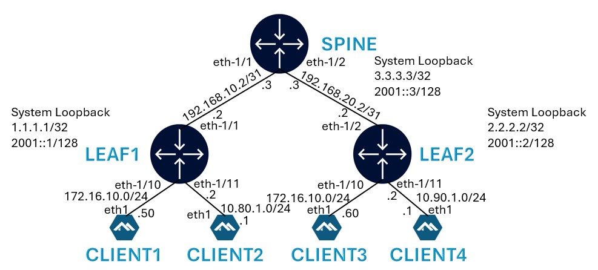

---
<div align=center>
<a href="https://codespaces.new/sajusal/wiki-arp?quickstart=1">
</a>

**[Run](https://codespaces.new/sajusal/wiki-arp?quickstart=1) this lab in GitHub Codespaces for free**.  
[Learn more](https://containerlab.dev/manual/codespaces/) about Containerlab for Codespaces.

</div>

---



# IRB Config on Leaf1 for Client1:

```srl
set / interface irb1 admin-state enable
set / interface irb1 subinterface 100 ipv4 admin-state enable
set / interface irb1 subinterface 100 ipv4 address 172.16.10.250/24 anycast-gw true
set / interface irb1 subinterface 100 ipv4 address 172.16.10.254/24 primary
set / interface irb1 subinterface 100 ipv4 arp learn-unsolicited true
set / interface irb1 subinterface 100 ipv4 arp evpn advertise dynamic
set / interface irb1 subinterface 100 anycast-gw
```

ARP entry on Leaf1:

```srl
A:admin@leaf1# show arpnd arp-entries interface irb1 subinterface 100
+--------+--------+---------------+--------+---------------+----------------------------+
| Interf | Subint |   Neighbor    | Origin |  Link layer   |           Expiry           |
|  ace   | erface |               |        |    address    |                            |
+========+========+===============+========+===============+============================+
| irb1   |    100 | 172.16.10.253 |   evpn | 1A:4B:06:FF:0 |                            |
|        |        |               |        | 0:42          |                            |
+--------+--------+---------------+--------+---------------+----------------------------+
------------------------------------------------------------------------------------------
  Total entries : 1 (0 static, 1 dynamic)
------------------------------------------------------------------------------------------
```

Ping from Leaf1 to Client1

```srl
A:admin@leaf1# ping -c 1 -I 172.16.10.250 172.16.10.50 network-instance ip-vrf-1
Using network instance ip-vrf-1
PING 172.16.10.50 (172.16.10.50) from 172.16.10.250 : 56(84) bytes of data.
64 bytes from 172.16.10.50: icmp_seq=1 ttl=64 time=19.9 ms

--- 172.16.10.50 ping statistics ---
1 packets transmitted, 1 received, 0% packet loss, time 0ms
rtt min/avg/max/mdev = 19.939/19.939/19.939/0.000 ms
```

ARP table after ping:

```srl
A:admin@leaf1# show arpnd arp-entries interface irb1 subinterface 100
+--------+--------+---------------+--------+---------------+----------------------------+
| Interf | Subint |   Neighbor    | Origin |  Link layer   |           Expiry           |
|  ace   | erface |               |        |    address    |                            |
+========+========+===============+========+===============+============================+
| irb1   |    100 |  172.16.10.50 | dynami | AA:C1:AB:B2:4 | 3 hours from now           |
|        |        |               |      c | 1:A2          |                            |
| irb1   |    100 | 172.16.10.253 |   evpn | 1A:4B:06:FF:0 |                            |
|        |        |               |        | 0:42          |                            |
+--------+--------+---------------+--------+---------------+----------------------------+
------------------------------------------------------------------------------------------
  Total entries : 2 (0 static, 2 dynamic)
------------------------------------------------------------------------------------------
```

ARPing from client1 for anycast IP:

```srl
bash-5.0# arping -b -I eth1 172.16.10.250
ARPING 172.16.10.250 from 172.16.10.50 eth1
Unicast reply from 172.16.10.250 [00:00:5E:00:01:01]  2.581ms
Unicast reply from 172.16.10.250 [00:00:5E:00:01:01]  2.710ms
Unicast reply from 172.16.10.250 [00:00:5E:00:01:01]  2.502ms
```
